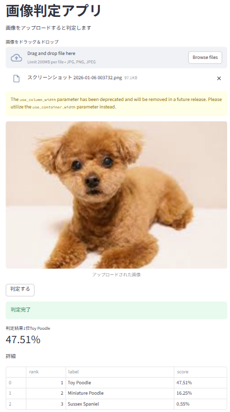

# 🦁 AI Image Classifier (ResNet50)

画像認識AIアプリです。
ユーザーがアップロードした画像を、Dockerコンテナ上で稼働するResNet50（ImageNet学習済みモデル）が解析し、何が写っているかを即座に判定します。

<p align='center'>
  
</p>

## 🛠 Tech Stack (使用技術)

* **Frontend:** Streamlit
* **Backend:** FastAPI
* **ML Model:** PyTorch (ResNet50)
* **Container:** Docker
* **Infrastructure:** AWS EC2 (Planned) / Local

## 🏗 Architecture

ユーザーが画像をアップロードしてから、AIが判定するまでの流れです。

```mermaid
graph TD
    User(("User")) -->|"Upload Image"| FE["Frontend (Streamlit)"]
    FE -->|POST /predict| API["Backend API (FastAPI)"]
    
    subgraph Docker Container
        API -->|Transform| Pre[Preprocess]
        Pre -->|Tensor| Model["ResNet50 (PyTorch)"]
        Model -->|Top 3 Results| API
    end
    
    API -->|JSON Response| FE
    FE -->|Display Result| User
